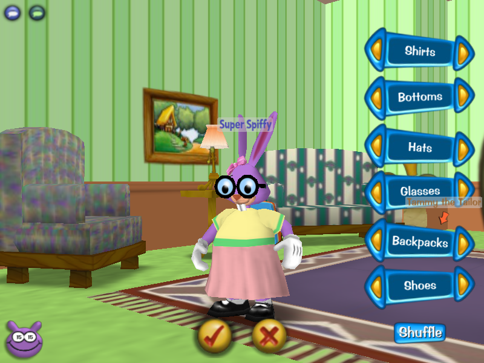
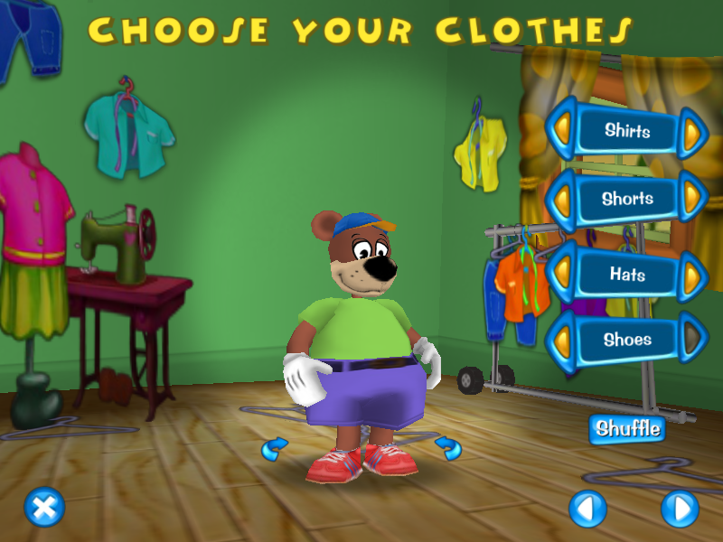
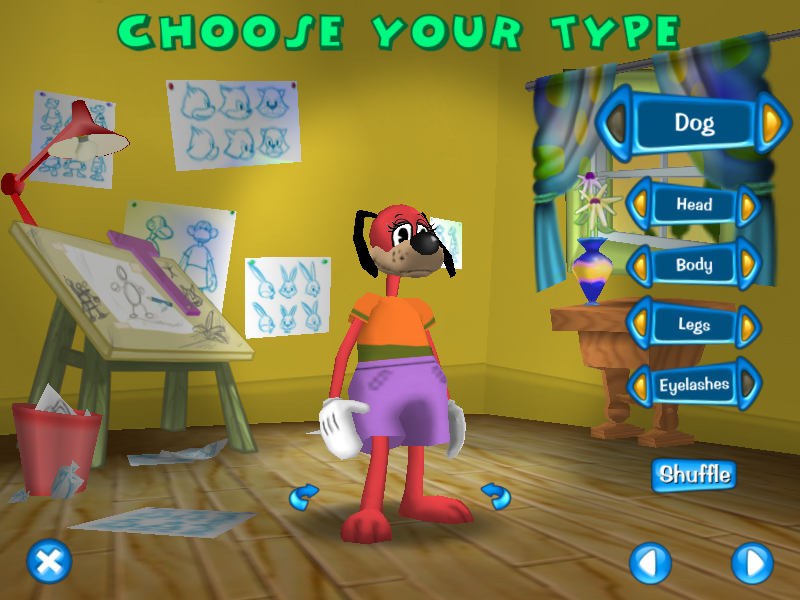
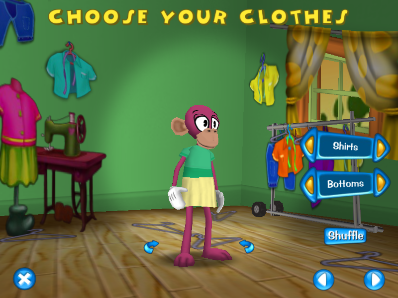

# open-toontown-mods

A fork of Open Toontown with some useful feature branches.

The `main` branch has some code that is missing from Open Toontown, but is otherwise 'vanilla' Toontown Online experience. The branches listed below add functionality, refactor code, or fix bugs. Note that I may occasionally rewrite the history of those branches to match any changes done to `main`.

---

## `avatar-panels-in-battle`


Allows the player to click on a Cog while in a battle.

**Feature:** Yes  
**Bugfix:** No  
**Changes `toon.dc`:** No  
**Changes the database structure:** Not applicable  

## `accessories-in-clothes-gui`



Allows the player to wear accessories in the Clothing Shop. Also supports creating a Toon with accessories.

**Feature:** Yes  
**Bugfix:** No  
**Changes `toon.dc`:** Yes  
**Changes the database structure:** No  

## `remove-gender`
Removes gender-specific restrictions, and adds an 'eyelashes' option in the Make-A-Toon.




**Feature:** Yes  
**Bugfix:** No  
**Changes `toon.dc`:** Yes  
**Changes the database structure:** No  

## `accessories-in-catalog-gui`


This very simple modification to `CatalogEmoteItem` makes accessories visible in the 'Acting Lessons' Cattlelog items.

**Feature:** Yes  
**Bugfix:** ?  
**Changes `toon.dc`:** No  
**Changes the database structure:** Not applicable  

---

Original README below:

# Open Toontown
This repository contains the code for Open Toontown, based on the latest version of Disney's Toontown Online (sv1.0.47.38).

# Setup
After cloning the repository, you will need to clone the [resources](https://github.com/open-toontown/resources) repository inside the directory where you cloned the source repo.

Secondly, you would have to install and use a specific version of Panda3D, which includes `libotp` and `libtoontown`.  You can use the prebuilt installers for your operating system here:

## Windows

You can install Panda3D SDK through the 32-bit (x86) or 64-bit (x86_64) installers here:

[Panda3D SDK for Windows (Python 3.9, x86, Last Updated: January 11, 2023)](https://mega.nz/file/6UsARa7R#pg5KgxW0NgkHEl_k0fK6NbBK8LfdEcDGZ6NsVeWwDKM)

[Panda3D SDK for Windows (Python 3.9, x86_64, Last Updated: January 11, 2023)](https://mega.nz/file/uAMxEKqL#yQfS9UPpYHzKYDR5vq-LF5gxxLa6HUmxLUp65uzneVo)

If you install Panda3D outside the default directory (or use the x86 installer), you may have to change the `PPYTHON_PATH` file located in the root directory and change it to your install directory.

## macOS 10.9+
[Panda3D Wheel for macOS 10.9+ (Python3.9, x86_64)](https://drive.google.com/file/d/1_6WJxrkNfwisK5pe5ubJJy1psEp0IIft/view?usp=sharing)

Installing the provided Panda3D wheel requires Python 3.9, which is not installed on your system by default whatsoever.  We recommend installing Python 3.9 through [Homebrew](https://brew.sh/) (Make sure that the xcode command line tools are installed first `xcode-select --install`): 
```shell
$ brew install python@3.9
```
(This will symlink Python 3.9 to `python3.9` and pip to `pip3`).

After installing Python 3.9.  You can then install the wheel by using pip:
```shell
$ pip install panda3d-1.11.0-cp39-cp39-macosx_10_9_x86_64.whl
```
## Linux (Building your own)
If you use Linux, or are interested in building Panda3D yourself, head on over to [our Panda3D fork](https://github.com/open-toontown/panda3d) and read the "Building Panda3D" section on the README file there.

# Starting the Server and Game
To start the server and run the game locally, go to your platform directory (`win32` for Windows, `darwin` for Mac and `linux` for Linux), and make sure you start the following scripts in order:

`Astron Server -> UberDOG (UD) Server -> AI (District) Server -> Game Client`

Be sure to wait till the servers have finished booting before starting the next.  If done correctly, you should be able to make your toon and play the game!  There is no support for Magic Words (commands) yet, [but it is currently in the works!](https://github.com/open-toontown/open-toontown/projects/1)

# Contributing
Submitting issues and Pull Requests are encouraged and welcome.

How you commit changes is your choice, but please include what you did and a basic description so that we know exactly what was modified. Here are some examples:

* `minigames: Fix crash when entering the trolley`
* `racing: Fix possible race condition when two racers tied`
* `golf: Refix wonky physics once and for all (hopefully)`
